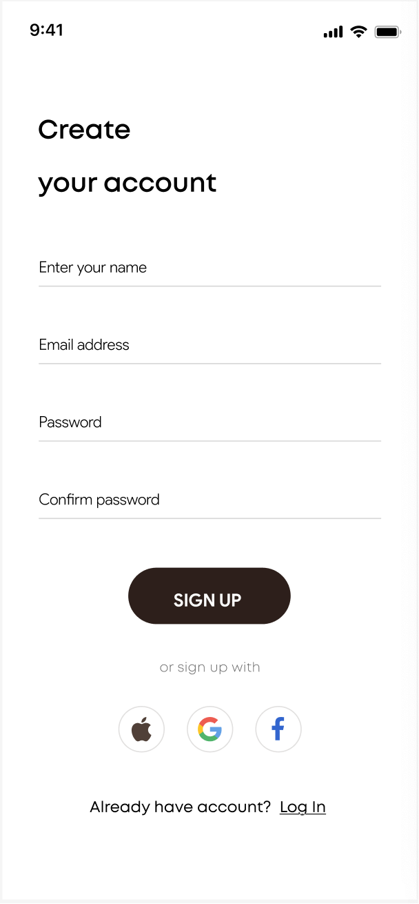

# Simple Login - Kotlin Multiplatform App

A modern, cross-platform mobile application built with **Kotlin Multiplatform** and **Compose Multiplatform**. This project demonstrates how to create a beautiful signup/login interface that works seamlessly on both Android and iOS platforms.

## FigmaInput

https://www.figma.com/design/OHgbyRpbe88pLXAdYlOud8/Simple_Login_1?node-id=0-1



## 🎨 Features

- **Cross-platform UI**: Single codebase for Android and iOS
- **Modern Design**: Clean, minimalist signup screen with custom styling
- **Social Login Options**: Apple, Google, and Facebook login buttons
- **Custom Components**: Custom text fields with password masking
- **Status Bar**: Realistic device status bar with battery, WiFi, and cellular indicators
- **Responsive Layout**: Optimized for different screen sizes

## 🏗️ Architecture

This project uses **Kotlin Multiplatform** with **Compose Multiplatform** for shared UI code:

### Project Structure

```
├── composeApp/                    # Shared Kotlin Multiplatform
│   └── src/
│       ├── commonMain/           # Shared code for all platforms
│       │   ├── kotlin/          # Main application logic
│       │   └── composeResources/ # Shared resources (icons, etc.)
│       ├── androidMain/         # Android-specific code
│       └── iosMain/             # iOS-specific code
├── iosApp/                      # iOS application wrapper
│   └── iosApp/
│       ├── iOSApp.swift         # iOS app entry point
│       └── ContentView.swift    # SwiftUI wrapper for Compose
└── gradle/                      # Build configuration
    └── libs.versions.toml       # Dependency versions
```

### Key Components

- **App.kt**: Main application with signup screen implementation
- **Custom UI Components**: Custom text fields, buttons, and status bar
- **Resource Management**: Shared icons and assets across platforms
- **Platform Integration**: Native wrappers for Android and iOS

## 🚀 Getting Started

### Prerequisites

- **Android Studio** or **IntelliJ IDEA**
- **Xcode** (for iOS development)
- **Kotlin** 2.2.0+
- **Android SDK** (API 24+)
- **iOS SDK** (iOS 13.0+)

### Setup Instructions

1. **Clone the repository**
   ```bash
   git clone <repository-url>
   cd Figma_MCP_SimpleLogin
   ```

2. **Open in Android Studio**
   - Open the project in Android Studio
   - Sync Gradle files
   - Build the project

3. **Run on Android**
   - Connect an Android device or start an emulator
   - Click "Run" in Android Studio
   - Or use command line: `./gradlew :composeApp:assembleDebug`

4. **Run on iOS**
   - Open `iosApp/iosApp.xcodeproj` in Xcode
   - Select your target device or simulator
   - Click "Run" in Xcode

## 🛠️ Technology Stack

### Core Technologies
- **Kotlin Multiplatform**: Cross-platform development
- **Compose Multiplatform**: Declarative UI framework
- **Material Design 3**: Modern design system
- **Gradle**: Build system with Kotlin DSL

### Dependencies
- **Compose Multiplatform**: 1.8.2
- **Kotlin**: 2.2.0
- **Android Gradle Plugin**: 8.12.0
- **Android SDK**: API 24-35
- **Coil**: Image loading library

### Platform Support
- **Android**: API 24+ (Android 7.0+)
- **iOS**: iOS 13.0+
- **Architectures**: ARM64, x86_64 (iOS Simulator)

## 🎯 UI Features

### Signup Screen
- **Form Fields**: Name, email, password, and confirm password
- **Password Masking**: Secure password input with visual transformation
- **Custom Styling**: Rounded corners, custom colors, and typography
- **Social Login**: Apple, Google, and Facebook integration buttons
- **Navigation**: "Log In" link for existing users

### Design System
- **Color Palette**: Dark black (#332218), medium dark (#2d201c), light gray (#d6d6d6)
- **Typography**: Custom font weights and sizes
- **Spacing**: Consistent padding and margins
- **Icons**: Custom status bar and social media icons

## 🔧 Development

### Building the Project

```bash
# Build for Android
./gradlew :composeApp:assembleDebug

# Build for iOS
./gradlew :composeApp:linkReleaseFrameworkIosArm64
```

### Project Configuration

The project uses centralized dependency management through `gradle/libs.versions.toml`:

- **Android**: Configured for API 24+ with Material Design 3
- **iOS**: SwiftUI wrapper for Compose Multiplatform
- **Shared**: Common UI components and business logic

### Code Organization

- **UI Components**: Reusable Compose components in `App.kt`
- **Resources**: Shared icons and assets in `composeResources/`
- **Platform Code**: Platform-specific implementations in respective folders
- **Configuration**: Build and dependency management in Gradle files

## 📱 Platform Integration

### Android
- Uses `MainActivity.kt` as the entry point
- Integrates with Android lifecycle components
- Supports Material Design 3 theming

### iOS
- Uses `iOSApp.swift` as the main app entry
- `ContentView.swift` provides SwiftUI wrapper for Compose
- `MainViewController.kt` bridges Compose with UIKit

## 🤝 Contributing

1. Fork the repository
2. Create a feature branch
3. Make your changes
4. Test on both Android and iOS
5. Submit a pull request

## 📄 License

This project is licensed under the MIT License - see the LICENSE file for details.

## 🔗 Resources

- [Kotlin Multiplatform Documentation](https://kotlinlang.org/docs/multiplatform.html)
- [Compose Multiplatform Documentation](https://www.jetbrains.com/lp/compose-multiplatform/)
- [Material Design 3](https://m3.material.io/)

---

Built with ❤️ using Kotlin Multiplatform and Compose Multiplatform